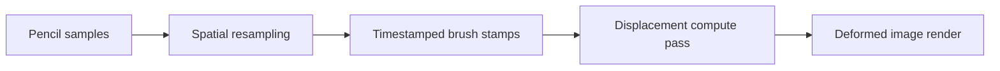

# Liquify Lab

Liquify Lab is an iPad prototype that records liquify gestures and plays them back over time. It explores the engineering behind a responsive creative tool: Apple Pencil input, custom UIKit controls, timeline playback, and a real time Metal displacement pipeline.

## Demo

## Highlights

- UIKit editor with a custom, directly scrubbable timeline
- Pressure sensitive Apple Pencil input using coalesced touch samples
- Metal compute and render pipelines that adapt to the GPU's read/write texture tier
- Non-destructive undo, redo, and reset
- Recorded gesture timing for animated playback
- Image import with `PHPickerViewController`
- Press-and-hold comparison with the original image
- Live frame time and estimated texture memory metrics
- Rendering at up to 120 Hz on supported iPads
- iOS 26 Liquid Glass materials with a fallback for iPadOS 18

## Architecture

The path from Pencil input to the rendered image stays simple:

- `LiquifyCanvasView` turns UIKit's coalesced touch samples into evenly spaced, pressure adjusted brush stamps in normalized image coordinates.
- `LiquifyRenderer` manages the source texture, displacement field, command encoding, edit history, and timeline reconstruction.
- The Metal fragment shader reads the displacement field and offsets where it samples the source image.

Edits are kept as a history of brush stamps, so the source image pixels never change. Undo and redo rebuild the displacement field from that history. During playback, the renderer applies each stamp when the playhead reaches its timestamp. Moving forward only adds newly reached stamps; scrubbing backward clears the field and rebuilds it up to the selected time.

## Engineering decisions

- Fixed size displacement field: The deformation grid stays at 320×320 no matter how large the source image is. That keeps GPU memory predictable and history rebuilds quick, while still providing enough detail for the available brush sizes.
- GPU texture storage: Support for different GPU capabilities based on [`MTLReadWriteTextureTier`](https://developer.apple.com/documentation/metal/mtlreadwritetexturetier). Both paths use 8 bytes per displacement pixel.
    - Tier 2 GPUs keep XY displacement together in one `rgba16Float` texture, while 
    - Tier 1 GPUs use two more widely supported `r32Float` textures.
- Non destructive history: Instead of saving full pixel snapshots, the app stores brush stamps and rebuilds the displacement field from them. The same history also drives animated playback.
- Smooth Pencil input: UIKit may deliver several Pencil samples at once, so the app resamples them into evenly spaced stamps before sending a batch to the GPU. This avoids gaps during fast strokes while keeping the original timing for playback.
- Clear hardware fallback: If a device doesn't support the required Metal read/write textures, the canvas explains the limitation instead of failing during renderer setup.

## Performance approach

- Stamps generated from an input sample are submitted together as one compute batch.
- Forward playback applies only the stamps newly crossed by the playhead.
- The lower resolution displacement field is sampled linearly when rendering the full size image.
- The app requests a 60–120 Hz frame rate range and reports measured frame time plus estimated texture memory in the editor.
- The matching Swift and Metal brush structures document their shared memory layout because they are copied directly through an `MTLBuffer`.

The compute kernel currently checks every submitted stamp against every cell in the displacement texture. That keeps the prototype simple and deterministic. A production version could limit dispatches to the brush bounds or add tile culling if profiling showed the extra complexity was worthwhile.

## Project map

- `LiquifyEditorViewController.swift` — editor composition, actions, playback, import, and metrics
- `LiquifyCanvasView.swift` — Pencil/touch handling and spatial resampling
- `LiquifyRenderer.swift` — Metal resources, history, timeline reconstruction, and encoding
- `LiquifyShaders.metal` — image rendering, brush application, and field clearing
- `EditorControls.swift` — timeline and parameter controls
- `LiquifyConfiguration.swift` — shared interaction and performance tuning
- `DemoImageFactory.swift` — procedural launch artwork with no bundled asset dependency

## Requirements and running

- Xcode with the Metal Toolchain component installed
- iPadOS 18 or later
- A physical iPad with Metal read/write texture support

1. Open `LiquifyLab.xcodeproj`.
2. Select the `MyApp` scheme and a physical iPad.
3. Build and run.
4. Drag on the demo artwork with Apple Pencil or one finger.
5. Open **Push** settings to adjust radius and strength, hold **Original** to compare, or press **Play** to replay the recorded gesture.

Core Simulator may report no read/write texture support even when the matching physical iPad supports the required formats, so physical hardware is the intended run destination.

## Deliberate scope

The prototype intentionally supports one push style liquify brush and one image in memory. It leaves out persistence, layers, masks, canvas zoom, additional liquify modes, and video import so the project can stay focused on interaction quality, rendering behavior, and a clear implementation.
